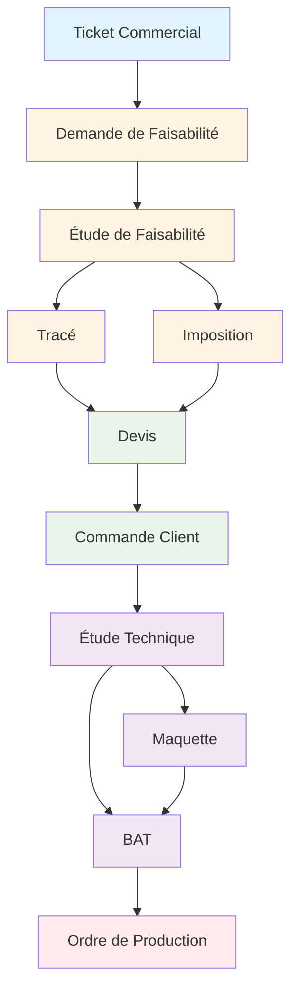
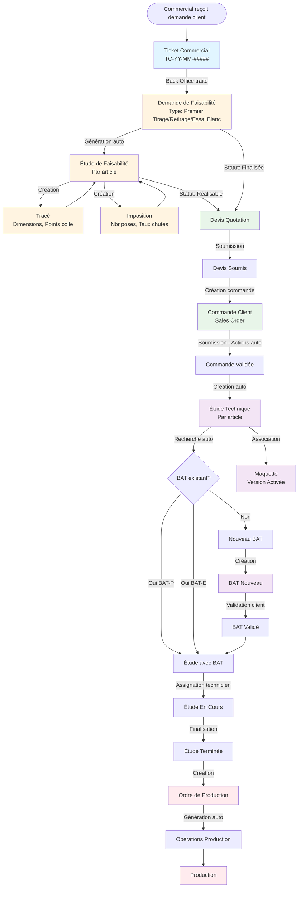
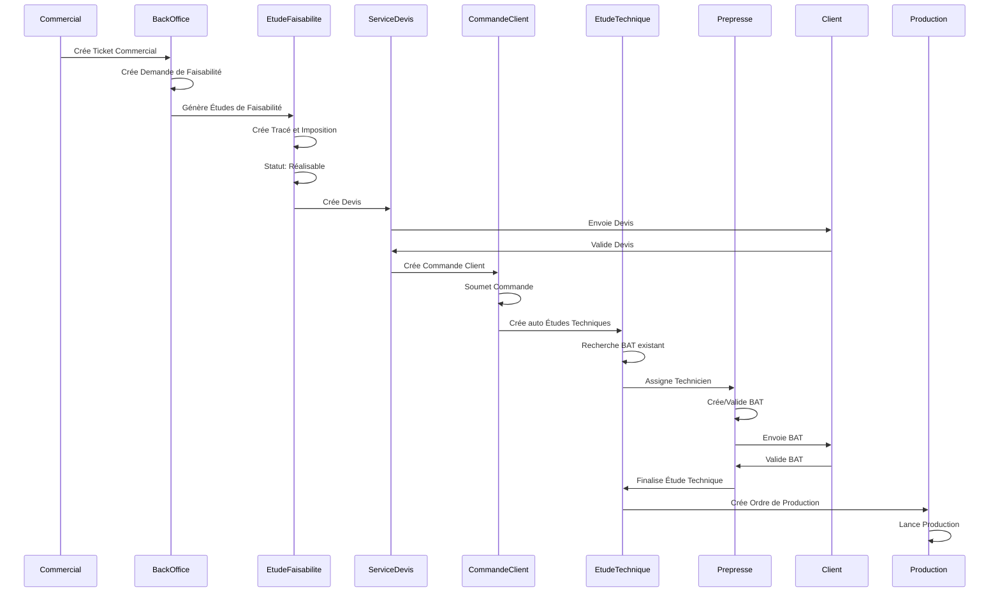

# Procédure Commerciale et Technique - Aures Emballages

## 📋 Table des matières

1. [Introduction](#introduction)
2. [Vue d'ensemble du processus](#vue-densemble-du-processus)
3. [Phase 1 : Collecte d'information commerciale](#phase-1--collecte-dinformation-commerciale)
4. [Phase 2 : Étude de faisabilité](#phase-2--étude-de-faisabilité)
5. [Phase 3 : Commercialisation](#phase-3--commercialisation)
6. [Phase 4 : Préparation technique](#phase-4--préparation-technique)
7. [Phase 5 : Production](#phase-5--production)
8. [Workflow complet](#workflow-complet)
9. [Rôles et responsabilités](#rôles-et-responsabilités)
10. [Statuts et transitions](#statuts-et-transitions)
11. [Annexes](#annexes)

---

## 🎯 Introduction

Ce document décrit la procédure complète de traitement d'une commande client depuis la collecte d'information par le commercial jusqu'à la production, en passant par toutes les étapes intermédiaires de faisabilité, commercialisation et préparation technique.

### Objectifs

- **Traçabilité** : Suivre chaque étape du processus commercial et technique
- **Efficacité** : Automatiser les transitions entre les différentes phases
- **Qualité** : S'assurer que toutes les validations sont effectuées avant la production
- **Collaboration** : Clarifier les rôles de chaque acteur à chaque étape

### Portée

Ce document couvre l'ensemble du processus depuis :
- La création d'un **Ticket Commercial** par le commercial
- Jusqu'à la création d'un **Ordre de Production** pour la fabrication

---

## 📊 Vue d'ensemble du processus

Le processus complet se décompose en 5 phases principales :

### Représentation textuelle du workflow

```
┌─────────────────────┐
│ Ticket Commercial   │
└──────────┬──────────┘
           │
           ▼
┌─────────────────────┐
│ Demande de          │
│ Faisabilité         │
└──────────┬──────────┘
           │
           ▼
┌─────────────────────┐
│ Étude de            │
│ Faisabilité         │
└──────┬──────────┬───┘
       │          │
       ▼          ▼
  ┌───────┐  ┌──────────┐
  │ Tracé │  │Imposition│
  └───┬───┘  └────┬─────┘
      │           │
      └─────┬─────┘
            │
            ▼
      ┌──────────┐
      │  Devis   │
      └─────┬────┘
            │
            ▼
   ┌────────────────┐
   │ Commande Client│
   └────────┬───────┘
            │
            ▼
   ┌────────────────┐
   │ Étude Technique│
   └────┬───────┬───┘
        │       │
        ▼       ▼
  ┌─────────┐ ┌──────┐
  │Maquette │ │ BAT  │
  └────┬────┘ └───┬──┘
       │          │
       └─────┬────┘
             │
             ▼
   ┌──────────────────┐
   │ Ordre de          │
   │ Production        │
   └───────────────────┘
```

### Diagramme Mermaid (si supporté)



### Phases du processus

1. **Phase 1 - Collecte d'information commerciale** : Ticket Commercial, Client, Article
2. **Phase 2 - Étude de faisabilité** : Demande de Faisabilité, Étude de Faisabilité, Tracé, Imposition
3. **Phase 3 - Commercialisation** : Devis, Commande Client
4. **Phase 4 - Préparation technique** : Étude Technique, Maquette, BAT
5. **Phase 5 - Production** : Ordre de Production

---

## 📝 Phase 1 : Collecte d'information commerciale

### 1.1 Ticket Commercial

**Objectif** : Centraliser toutes les demandes commerciales et transmettre les informations au back office.

**Création** : Par le commercial lors d'un contact client

**Informations requises** :
- **Client** : Obligatoire - Sélection du client concerné
- **Type de demande** : Obligatoire
  - Création (nouveau client, nouveau produit)
  - Bon de commande
  - Demande de devis
  - Mise à jour données
  - Réclamation commerciale
  - Autre
- **Priorité** : Obligatoire (Basse, Moyenne, Haute)
- **Canal** : Téléphone, Email, WhatsApp, Raven, Autre
- **Description détaillée** : Description complète de la demande
- **Fichiers joints** : Documents, photos, plans techniques

**Numérotation** : Automatique au format `TC-YY-MM-#####`
- Exemple : `TC-25-12-00001` (Ticket Commercial créé en décembre 2025)

**Statuts** :
- **Nouveau** : Ticket créé, en attente de traitement
- **En Cours** : Ticket pris en charge par le back office
- **Pending** : Ticket mis en pause temporairement
- **Terminé** : Ticket traité et finalisé
- **Annulé** : Ticket annulé

**Workflow** :
```
Nouveau → En Cours → Terminé
         ↓
      Pending → En Cours → Terminé
```

### 1.2 Client

**Création** : Via Ticket Commercial de type "Création" ou directement dans ERPNext

**Informations principales** :
- Raison sociale
- Adresse
- Contacts
- Commercial attribué
- Groupe client

**Rôle dans le processus** : Le client est référencé dans tous les documents suivants (Demande de Faisabilité, Devis, Commande, etc.)

### 1.3 Article

**Création** : Via Ticket Commercial de type "Création" ou directement dans ERPNext

**Informations principales** :
- Code article
- Désignation
- Procédé (Offset, Flexo)
- Client propriétaire
- Caractéristiques techniques

**Rôle dans le processus** : L'article est référencé dans toutes les étapes suivantes (Étude de Faisabilité, Devis, Commande, Étude Technique, etc.)

---

## 🔍 Phase 2 : Étude de faisabilité

### 2.1 Demande de Faisabilité

**Objectif** : Centraliser une demande client pour plusieurs articles et coordonner les études de faisabilité.

**Création** : Par le back office depuis un Ticket Commercial

**Informations requises** :
- **Client** : Obligatoire
- **Date de livraison souhaitée** : Obligatoire
- **Type** : Obligatoire
  - Premier Tirage
  - Retirage (nécessite N° Bon de Commande)
  - Essai Blanc
- **Liste d'articles** : Table avec les articles à étudier

**Statuts** :
- **Brouillon** : Demande en cours de création
- **Confirmée** : Demande validée, prête pour génération des études
- **En Cours** : Études de faisabilité en cours
- **Partiellement Finalisée** : Certaines études sont terminées
- **Finalisée** : Toutes les études sont terminées
- **Devis Établis** : Un ou plusieurs devis ont été créés
- **Commandé** : Une ou plusieurs commandes ont été créées
- **Fermée** : Processus terminé
- **Annulée** : Demande annulée

**Workflow** :
```
Brouillon → Confirmée → En Cours → Partiellement Finalisée → Finalisée → Devis Établis → Commandé → Fermée
```

**Actions possibles** :
- Génération automatique des Études de Faisabilité depuis le statut "Brouillon"
- Mise à jour automatique du statut lors de la création de devis/commandes

### 2.2 Étude de Faisabilité

**Objectif** : Analyser la faisabilité technique d'un article spécifique.

**Création** : Automatique depuis une Demande de Faisabilité (une étude par article)

**Informations principales** :
- **Demande de Faisabilité** : Lien vers la demande parente
- **Client** : Récupéré depuis la demande
- **Article** : Article étudié
- **Quantité** : Quantité demandée
- **Date échéance** : Date limite pour finaliser l'étude
- **Date livraison souhaitée** : Récupérée depuis la demande
- **Procédé** : Offset ou Flexo (récupéré depuis l'article)
- **Tracé** : Lien vers le document Tracé (créé dans cette phase)
- **Imposition** : Lien vers le document Imposition (créé dans cette phase)

**Statuts** :
- **Nouveau** : Étude créée, en attente de traitement
- **En étude** : Étude en cours d'analyse
- **Réalisable** : L'article peut être produit selon les spécifications
- **Non Réalisable** : L'article ne peut pas être produit selon les spécifications
- **Annulée** : Étude annulée

**Workflow** :
```
Nouveau → En étude → Réalisable / Non Réalisable
```

**Actions possibles** :
- Création de Tracé et Imposition depuis l'étude
- Soumission de l'étude (statut "Réalisable" requis pour créer un devis)

### 2.3 Tracé

**Objectif** : Définir les dimensions et caractéristiques du tracé d'impression.

**Création** : Par le service Étude de Faisabilité dans le cadre d'une Étude de Faisabilité

**Informations principales** :
- **Client** : Récupéré depuis l'étude
- **Article** : Récupéré depuis l'étude
- **Procédé** : Offset ou Flexo (récupéré depuis l'article)
- **Dimensions** : Dimensions du tracé
- **Points colle** : Nombre de points de colle
- **Fichier Tracé** : Fichier PDF ou image du tracé

**Rôle** : Le Tracé est utilisé dans l'Étude Technique pour la préparation de la production.

### 2.4 Imposition

**Objectif** : Définir l'imposition des feuilles pour optimiser la production et calculer le taux de chutes.

**Création** : Par le service Étude de Faisabilité après la création du Tracé

**Informations principales** :
- **Client** : Récupéré depuis l'étude
- **Article** : Récupéré depuis l'étude
- **Tracé** : Lien vers le Tracé associé
- **Procédé** : Offset ou Flexo (récupéré depuis l'article)
- **Format d'impression** : Format de la feuille d'impression
- **Laize / Palette** : Type de format
- **Format Laize / Palette** : Dimensions précises
- **Nombre de poses** : Nombre d'exemplaires par feuille
- **Taux de chutes** : Pourcentage de chutes calculé
- **Forme Découpe** : Lien vers la forme de découpe si nécessaire
- **Fichier Imposition** : Fichier PDF de l'imposition

**Rôle** : L'Imposition est utilisée dans l'Étude Technique pour calculer les quantités de feuilles nécessaires et optimiser la production.

---

## 💼 Phase 3 : Commercialisation

### 3.1 Devis (Quotation)

**Objectif** : Proposer un prix et des conditions commerciales au client.

**Création** : Par le service Devis depuis une Demande de Faisabilité avec statut "Finalisée"

**Informations principales** :
- **Client** : Récupéré depuis la demande de faisabilité
- **Demande de Faisabilité** : Lien vers la demande source
- **Articles** : Liste des articles avec quantités et prix
- **Date de livraison** : Date proposée de livraison
- **Conditions commerciales** : Remises, délais de paiement, etc.

**Statuts ERPNext** :
- **Draft** : Devis en brouillon
- **Submitted** : Devis soumis au client
- **Ordered** : Devis transformé en commande (partiellement ou totalement)
- **Lost** : Devis perdu
- **Cancelled** : Devis annulé

**Statuts personnalisés** :
- **Non commandé** : Aucune commande créée
- **Partiellement commandé** : Une partie des articles a été commandée
- **Entièrement commandé** : Tous les articles ont été commandés

**Actions automatiques** :
- Mise à jour du statut de la Demande de Faisabilité à "Devis Établis" lors de la soumission
- Notification au commercial attribué lors de la validation du devis

**Création de Commande Client** :
- Possibilité de créer une Commande Client depuis le devis
- Gestion des commandes partielles (articles restants)
- Gestion des commandes en brouillon

### 3.2 Commande Client (Sales Order)

**Objectif** : Confirmer la commande du client et déclencher la préparation technique.

**Création** : Depuis un Devis validé (soumis)

**Informations principales** :
- **Client** : Récupéré depuis le devis
- **Devis** : Lien vers le devis source
- **Demande de Faisabilité** : Récupérée depuis le devis
- **Articles** : Liste des articles commandés avec quantités et prix
- **Date de livraison** : Date de livraison confirmée
- **Bon de Commande Client** : Numéro du bon de commande client (obligatoire avant soumission)
- **Date Bon de Commande** : Date du bon de commande client (obligatoire avant soumission)
- **Liste Maquettes** : Table des maquettes associées à chaque article

**Statuts ERPNext** :
- **Draft** : Commande en brouillon
- **Submitted** : Commande validée
- **Cancelled** : Commande annulée

**Actions automatiques lors de la soumission** :

1. **Mise à jour du Devis** :
   - Statut du devis mis à jour selon le pourcentage de commande
   - Calcul automatique du statut personnalisé (Non commandé / Partiellement commandé / Entièrement commandé)

2. **Mise à jour de la Demande de Faisabilité** :
   - Statut mis à jour à "Commandé" si toutes les études sont commandées

3. **Création automatique des Études Techniques** :
   - Une Étude Technique est créée automatiquement pour chaque article de la commande
   - Récupération automatique des informations depuis l'Étude de Faisabilité (Tracé, Imposition)
   - Recherche automatique d'un BAT existant pour l'article (priorité BAT-P Validé, puis BAT-E Validé)
   - Association automatique de la Maquette si disponible

**Validation avant soumission** :
- Vérification obligatoire des champs "Bon de Commande Client" et "Date Bon de Commande"

---

## 🔧 Phase 4 : Préparation technique

### 4.1 Étude Technique

**Objectif** : Préparer tous les éléments techniques nécessaires à la production.

**Création** : Automatique lors de la soumission d'une Commande Client (une étude par article)

**Informations principales** :
- **Commande** : Lien vers la Commande Client
- **Devis** : Lien vers le Devis source
- **Demande de Faisabilité** : Lien vers la Demande de Faisabilité
- **Client** : Récupéré depuis la commande
- **Article** : Article concerné
- **Quantité** : Quantité à produire
- **Date d'échéance** : Date limite pour finaliser l'étude
- **Technicien** : Technicien Prepresse assigné
- **Tracé** : Récupéré depuis l'Étude de Faisabilité
- **Imposition** : Récupéré depuis l'Étude de Faisabilité
- **Maquette** : Maquette associée (si disponible)
- **BAT** : BAT associé (recherché automatiquement ou créé)
- **Procédé** : Offset ou Flexo
- **Nombre de poses** : Récupéré depuis l'Imposition
- **Quantité Feuilles** : Calculée automatiquement (Quantité / Nombre de poses)
- **Taux de chutes** : Récupéré depuis l'Imposition
- **Machine** : Station de travail assignée
- **Ordre de Production** : Lien vers l'ordre créé depuis cette étude

**Statuts** :
- **Nouveau** : Étude créée, en attente d'assignation
- **En Cours** : Étude prise en charge par un technicien
- **Terminée** : Étude finalisée, prête pour production
- **Annulée** : Étude annulée

**Workflow** :
```
Nouveau → En Cours → Terminée
```

**Actions automatiques** :
- Recherche automatique d'un BAT existant pour l'article lors de la création
- Calcul automatique de la quantité de feuilles (Quantité / Nombre de poses)
- Association automatique du Tracé et de l'Imposition depuis l'Étude de Faisabilité

**Actions possibles** :
- Création d'un nouveau BAT depuis l'étude
- Liaison d'un BAT existant à l'étude
- Création d'un Ordre de Production depuis l'étude terminée

### 4.2 Maquette

**Objectif** : Gérer les versions de maquettes pour chaque article client.

**Création** : 
- Automatique lors de la création d'une Étude de Faisabilité (si nouvelle conception)
- Manuelle par le service Prepresse

**Informations principales** :
- **Client** : Client propriétaire
- **Article** : Article concerné
- **Version** : Numéro de version (incrémenté automatiquement)
- **Version d'origine** : Lien vers la maquette parente (pour les versions)
- **Mode Couleur** : CMJN, Pantone uniquement, CMJN + Pantone
- **Nombre de Couleurs Process** : Pour les modes CMJN
- **Détails CMJN** : Table des couleurs CMJN utilisées
- **Nombre de Couleurs Spot** : Pour les modes Pantone
- **Couleurs Spot** : Table des couleurs Pantone utilisées
- **Fichier Maquette** : Image de la maquette (version légère)
- **Nom Fichier Maquette** : Nom du fichier source
- **Responsable** : Responsable de la maquette
- **Référencé par** : Utilisateur qui a référencé la maquette

**Statuts** :
- **A référencer** : Maquette créée, en attente de référencement
- **Référencée** : Maquette référencée et validée
- **Version Activée** : Version active utilisée pour la production
- **Obsolète** : Version remplacée par une nouvelle version
- **Détruite** : Maquette détruite physiquement

**Workflow** :
```
A référencer → Référencée → Version Activée
                           ↓
                        Obsolète → Détruite
```

**Rôle** : La maquette active (Version Activée) est associée automatiquement aux commandes et aux études techniques.

### 4.3 BAT (Bon À Tirer)

**Objectif** : Valider l'aspect visuel et technique avant la production.

**Création** : 
- Automatique lors de la création d'une Étude Technique (recherche d'un BAT existant)
- Manuelle depuis une Étude Technique
- Manuelle par le service Prepresse

**Types de BAT** :
- **BAT-E (Électronique)** : BAT validé électroniquement par le client
- **BAT-P (Physique)** : BAT physique validé par le client

**Informations principales** :
- **Client** : Récupéré depuis l'article
- **Article** : Article concerné
- **Tracé** : Lien vers le Tracé utilisé
- **Maquette** : Lien vers la Maquette utilisée
- **Étude Technique** : Lien vers l'étude technique associée
- **Date création** : Date de création du BAT
- **Code BAT Client** : Référence client du BAT (version)
- **Image BAT** : Image combinée (Tracé + Maquette) sans en-tête
- **Fichier Validé** : Fichier validé par le client
- **Dimensions Tracé** : Récupérées depuis le Tracé

**Statuts** :
- **Nouveau** : BAT créé, en attente de validation
- **BAT-E Validé** : BAT électronique validé par le client
- **BAT-P Validé** : BAT physique validé par le client
- **Obsolète** : BAT remplacé par une nouvelle version

**Workflow** :
```
Nouveau → BAT-E Validé → BAT-P Validé
         ↓
      Obsolète
```

**Validation** :
- **BAT-E Validé** : Validé par un utilisateur interne (valide_par)
- **BAT-P Validé** : Validé après échantillon physique (echantillon_par)

**Rôle** : 
- Le BAT validé (BAT-P ou BAT-E) est recherché automatiquement lors de la création d'une Étude Technique
- Un BAT obsolète est automatiquement marqué comme tel lors de la création d'un nouveau BAT pour le même article

---

## 🏭 Phase 5 : Production

### 5.1 Ordre de Production

**Objectif** : Planifier et suivre la production d'un article.

**Création** : Depuis une Étude Technique terminée (soumise)

**Informations principales** :
- **Étude Technique** : Lien vers l'étude source
- **Commande Client** : Lien vers la commande client
- **Client** : Récupéré depuis l'étude
- **Article** : Article à produire
- **BAT** : BAT validé utilisé
- **Quantité à produire** : Quantité commandée
- **Route de Production** : Route sélectionnée selon le procédé
- **Statut** : Nouveau, En Production, En Pause, Terminé, Annulé
- **Priorité** : Normale, Urgente, Très Urgente
- **Opérations** : Table des opérations générées depuis la route

**Création automatique** :
- Sélection automatique de la route de production selon le procédé de l'étude
- Génération automatique des opérations depuis la route de production
- Lien automatique vers l'Étude Technique

**Validation avant création** :
- L'Étude Technique doit être soumise
- Aucun Ordre de Production ne doit déjà exister pour cette étude
- Une route de production active doit exister pour le procédé

---

## 🔄 Workflow complet

### Diagramme de flux détaillé

#### Représentation textuelle du workflow détaillé

```
Commercial reçoit demande client
           │
           ▼
┌──────────────────────┐
│ Ticket Commercial    │
│ TC-YY-MM-#####       │
└──────────┬───────────┘
           │ Back Office traite
           ▼
┌──────────────────────┐
│ Demande de           │
│ Faisabilité          │
│ Type: Premier Tirage │
│ Retirage/Essai Blanc │
└──────────┬───────────┘
           │ Génération auto
           ▼
┌──────────────────────┐
│ Étude de             │
│ Faisabilité          │
│ (Par article)        │
└──────┬───────────┬───┘
       │           │
       │ Création  │ Création
       ▼           ▼
  ┌────────┐  ┌──────────────┐
  │ Tracé  │  │ Imposition   │
  │ Dims,  │  │ Nbr poses,   │
  │ Points │  │ Taux chutes  │
  └───┬────┘  └──────┬───────┘
      │             │
      └──────┬──────┘
             │
             ▼
      ┌──────────────┐
      │ Devis        │
      │ Quotation    │
      └──────┬───────┘
             │ Soumission
             ▼
      ┌──────────────┐
      │ Devis Soumis │
      └──────┬───────┘
             │ Création commande
             ▼
      ┌──────────────┐
      │ Commande     │
      │ Client       │
      │ Sales Order  │
      └──────┬───────┘
             │ Soumission - Actions auto
             ▼
      ┌──────────────┐
      │ Commande     │
      │ Validée      │
      └──────┬───────┘
             │ Création auto
             ▼
      ┌──────────────┐
      │ Étude        │
      │ Technique    │
      │ (Par article)│
      └──────┬───────┘
             │
             ├─── Recherche auto ───┐
             │                      │
             │                      ▼
             │              ┌──────────────┐
             │              │ BAT existant?│
             │              └───┬──────┬───┘
             │                  │      │
             │         Oui BAT-P│      │Oui BAT-E
             │                  │      │
             │                  ▼      ▼
             │              ┌──────────────┐
             │              │ Étude avec BAT│
             │              └───────┬───────┘
             │                      │
             │              Non     │
             │                  │   │
             │                  ▼   │
             │              ┌───────┴───────┐
             │              │ Nouveau BAT   │
             │              └───────┬───────┘
             │                      │ Validation client
             │                      ▼
             │              ┌──────────────┐
             │              │ BAT Validé   │
             │              └───────┬───────┘
             │                      │
             └─── Association ──────┘
                     │
                     ▼
              ┌──────────────┐
              │ Maquette     │
              │ Version      │
              │ Activée      │
              └───────┬──────┘
                      │
                      ▼
              ┌──────────────┐
              │ Étude En     │
              │ Cours        │
              └───────┬──────┘
                      │ Finalisation
                      ▼
              ┌──────────────┐
              │ Étude        │
              │ Terminée     │
              └───────┬──────┘
                      │ Création
                      ▼
              ┌──────────────┐
              │ Ordre de     │
              │ Production   │
              └───────┬──────┘
                      │ Génération auto
                      ▼
              ┌──────────────┐
              │ Opérations   │
              │ Production   │
              └───────┬──────┘
                      │
                      ▼
              ┌──────────────┐
              │ Production   │
              └──────────────┘
```

#### Diagramme Mermaid (si supporté)



### Séquence temporelle

#### Représentation textuelle de la séquence

```
Commercial
    │
    ├─> Crée Ticket Commercial
    │
Back Office
    │
    ├─> Crée Demande de Faisabilité
    │
    ├─> Génère Études de Faisabilité ──┐
    │                                   │
Étude Faisabilité                      │
    │                                   │
    ├─> Crée Tracé et Imposition        │
    │                                   │
    ├─> Statut: Réalisable              │
    │                                   │
    └─> Crée Devis ─────────────────────┘
        │
Service Devis
    │
    ├─> Envoie Devis ──────────────┐
    │                               │
Client                              │
    │                               │
    └─> Valide Devis ───────────────┘
        │
Service Devis
    │
    └─> Crée Commande Client ────────┐
        │                            │
Commande Client                      │
    │                                │
    ├─> Soumet Commande              │
    │                                │
    └─> Crée auto Études Techniques ─┘
        │
Étude Technique
    │
    ├─> Recherche BAT existant
    │
    └─> Assigne Technicien ──────────┐
        │                            │
Prepresse                            │
    │                                │
    ├─> Crée/Valide BAT              │
    │                                │
    ├─> Envoie BAT ──────────────┐   │
    │                            │   │
Client                          │   │
    │                            │   │
    └─> Valide BAT ──────────────┘   │
        │                             │
Prepresse                            │
    │                                 │
    └─> Finalise Étude Technique ─────┘
        │
Étude Technique
    │
    └─> Crée Ordre de Production ─────┐
        │                             │
Production                            │
    │                                 │
    └─> Lance Production ─────────────┘
```

#### Diagramme Mermaid (si supporté)



---

## 👥 Rôles et responsabilités

### Par phase

| Phase | Rôle | Responsabilités |
|-------|------|-----------------|
| **Phase 1** | Commercial | Créer Ticket Commercial avec toutes les informations client |
| | Back Office | Traiter les tickets, créer/mettre à jour Clients et Articles |
| **Phase 2** | Back Office | Créer Demande de Faisabilité depuis le ticket |
| | Chargé Étude Faisabilité | Créer Études de Faisabilité, Tracés et Impositions |
| | Responsable Étude Faisabilité | Valider les études (statut Réalisable/Non Réalisable) |
| **Phase 3** | Chargé Devis | Créer les Devis depuis les Demandes de Faisabilité |
| | Responsable Devis | Valider les Devis |
| | Commercial | Suivre les Devis, créer Commandes Client |
| | Back Office | Valider les Commandes Client (vérifier Bon de Commande) |
| **Phase 4** | Système | Créer automatiquement les Études Techniques |
| | Responsable Prepresse | Assigner les techniciens aux études |
| | Technicien Prepresse | Traiter les études, créer/valider BATs |
| | Client | Valider les BATs (électronique ou physique) |
| **Phase 5** | Responsable Prepresse | Créer Ordres de Production depuis études terminées |
| | Production | Exécuter les ordres de production |

### Rôles détaillés

#### Commercial Itinérant / Commercial Sédentaire
- Créer et gérer les Tickets Commerciaux
- Suivre les Devis et Commandes
- Communiquer avec les clients
- Consulter les Maquettes et BATs

#### Back Office / Administrateur Ventes
- Traiter tous les Tickets Commerciaux
- Créer et gérer les Demandes de Faisabilité
- Créer et valider les Devis
- Valider les Commandes Client
- Accès complet à tous les documents

#### Chargé Étude Faisabilité
- Créer les Études de Faisabilité
- Créer les Tracés et Impositions
- Analyser la faisabilité technique

#### Responsable Étude Faisabilité
- Valider les Études de Faisabilité (Réalisable/Non Réalisable)
- Superviser le processus d'étude

#### Chargé Devis
- Créer les Devis depuis les Demandes de Faisabilité
- Consulter les Études de Faisabilité

#### Responsable Devis
- Valider les Devis
- Superviser le processus commercial

#### Technicien Prepresse
- Traiter les Études Techniques
- Créer et gérer les BATs
- Créer et gérer les Maquettes
- Créer les Ordres de Production

#### Responsable Prepresse
- Assigner les techniciens
- Valider les Études Techniques
- Superviser le processus technique
- Créer les Ordres de Production

#### Coordination
- Suivre l'ensemble du processus
- Coordonner entre les différents services

---

## 📊 Statuts et transitions

### Tableau récapitulatif des statuts

| Document | Statuts possibles | Transition principale |
|----------|-------------------|----------------------|
| **Ticket Commercial** | Nouveau → En Cours → Terminé<br/>Pending (pause) | Nouveau → En Cours → Terminé |
| **Demande de Faisabilité** | Brouillon → Confirmée → En Cours → Partiellement Finalisée → Finalisée → Devis Établis → Commandé → Fermée | Brouillon → Confirmée → Finalisée → Commandé |
| **Étude de Faisabilité** | Nouveau → En étude → Réalisable / Non Réalisable | Nouveau → En étude → Réalisable |
| **Tracé** | (Pas de statut) | Création directe |
| **Imposition** | (Pas de statut) | Création directe |
| **Devis** | Draft → Submitted → Ordered<br/>Non commandé → Partiellement commandé → Entièrement commandé | Draft → Submitted → Ordered |
| **Commande Client** | Draft → Submitted | Draft → Submitted (déclenche création Études Techniques) |
| **Étude Technique** | Nouveau → En Cours → Terminée | Nouveau → En Cours → Terminée |
| **Maquette** | A référencer → Référencée → Version Activée<br/>Obsolète → Détruite | A référencer → Référencée → Version Activée |
| **BAT** | Nouveau → BAT-E Validé → BAT-P Validé<br/>Obsolète | Nouveau → BAT-E Validé → BAT-P Validé |
| **Ordre de Production** | Nouveau → En Production → En Pause → Terminé | Nouveau → En Production → Terminé |

### Conditions de transition

#### De Ticket Commercial à Demande de Faisabilité
- **Condition** : Ticket Commercial au statut "En Cours" ou "Terminé"
- **Action** : Back Office crée manuellement la Demande de Faisabilité

#### De Demande de Faisabilité à Étude de Faisabilité
- **Condition** : Demande de Faisabilité au statut "Brouillon"
- **Action** : Génération automatique depuis le bouton "Générer Études"

#### D'Étude de Faisabilité à Devis
- **Condition** : 
  - Toutes les Études de Faisabilité au statut "Réalisable"
  - Demande de Faisabilité au statut "Finalisée"
- **Action** : Création manuelle du Devis par le service Devis

#### De Devis à Commande Client
- **Condition** : Devis au statut "Submitted"
- **Action** : Création depuis le Devis (bouton "Créer Commande")

#### De Commande Client à Étude Technique
- **Condition** : Commande Client soumise (on_submit)
- **Action** : Création automatique d'une Étude Technique par article
- **Déclencheurs automatiques** :
  - Recherche BAT existant
  - Association Tracé et Imposition depuis Étude de Faisabilité
  - Association Maquette si disponible

#### D'Étude Technique à Ordre de Production
- **Condition** : 
  - Étude Technique au statut "Terminée" et soumise
  - Aucun Ordre de Production existant pour cette étude
  - Route de production active existe pour le procédé
- **Action** : Création manuelle depuis l'Étude Technique

---

## 📎 Annexes

### A. Numérotation des documents

| Document | Format | Exemple |
|----------|--------|---------|
| Ticket Commercial | `TC-YY-MM-#####` | `TC-25-12-00001` |
| Demande de Faisabilité | Auto-incrément | `DF-00001` |
| Étude de Faisabilité | Auto-incrément | `EF-00001` |
| Tracé | Auto-incrément | `TR-00001` |
| Imposition | Auto-incrément | `IMP-00001` |
| Devis | Format ERPNext | `QT-00001` |
| Commande Client | Format ERPNext | `SO-00001` |
| Étude Technique | Auto-incrément | `ET-00001` |
| Maquette | Auto-incrément | `MAQ-00001` |
| BAT | Auto-incrément | `BAT-00001` |
| Ordre de Production | `OP-YYYY-#####` | `OP-2025-00001` |

### B. Champs obligatoires par document

#### Ticket Commercial
- Client
- Type
- Priorité
- Description

#### Demande de Faisabilité
- Client
- Date de livraison souhaitée
- Type
- Liste d'articles (au moins un article)

#### Étude de Faisabilité
- Demande de Faisabilité
- Client
- Article
- Quantité
- Date échéance
- Date livraison souhaitée

#### Commande Client
- Client
- Articles (au moins un)
- Bon de Commande Client (avant soumission)
- Date Bon de Commande (avant soumission)

#### Étude Technique
- Commande
- Client
- Article
- Quantité
- Date d'échéance

### C. Actions automatiques

#### Lors de la soumission d'une Commande Client
1. Mise à jour du statut du Devis lié
2. Mise à jour du statut de la Demande de Faisabilité
3. Création automatique des Études Techniques (une par article)
4. Recherche automatique des BATs existants
5. Association automatique des Tracés et Impositions
6. Association automatique des Maquettes

#### Lors de la création d'une Étude Technique
1. Recherche automatique d'un BAT existant (priorité BAT-P Validé)
2. Calcul automatique de la quantité de feuilles
3. Récupération automatique du nombre de poses depuis l'Imposition
4. Récupération automatique du taux de chutes depuis l'Imposition

#### Lors de la création d'un nouveau BAT
1. Marquage automatique de l'ancien BAT comme obsolète (si existe)

#### Lors de la création d'un Ordre de Production
1. Génération automatique des opérations depuis la route de production
2. Lien automatique vers l'Étude Technique

### D. Bonnes pratiques

#### Pour les Commerciaux
- Remplir tous les champs du Ticket Commercial de manière détaillée
- Joindre tous les documents nécessaires (photos, plans, emails)
- Indiquer clairement les délais souhaités
- Vérifier régulièrement l'état des tickets

#### Pour le Back Office
- Traiter les tickets rapidement selon leur priorité
- Vérifier la cohérence des informations avant de créer les Demandes de Faisabilité
- S'assurer que tous les articles sont bien renseignés

#### Pour les Services Techniques
- Finaliser les Études de Faisabilité dans les délais
- Créer les Tracés et Impositions avec précision
- Valider les BATs avant de les envoyer aux clients
- Maintenir les Maquettes à jour avec les bonnes versions

#### Pour la Production
- Vérifier que l'Étude Technique est complète avant de créer l'Ordre de Production
- S'assurer que le BAT est validé avant de lancer la production

---

## 📅 Historique des modifications

- **Version 1.0** - Décembre 2025 : Création du document de procédure complète

---

**Dernière mise à jour :** Décembre 2025  
**Auteur :** Équipe Aures CRM

